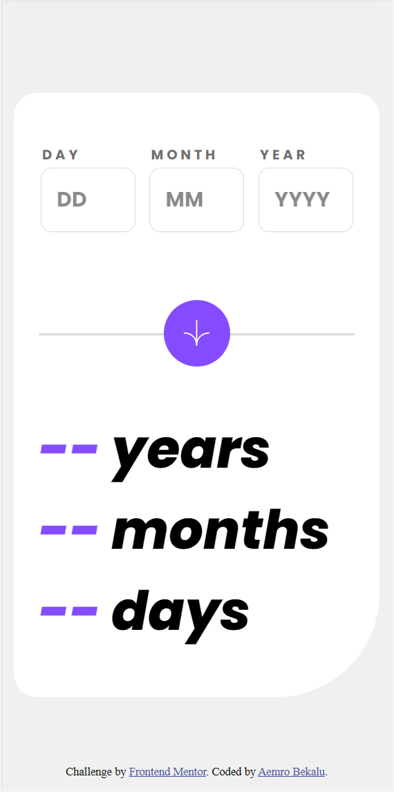
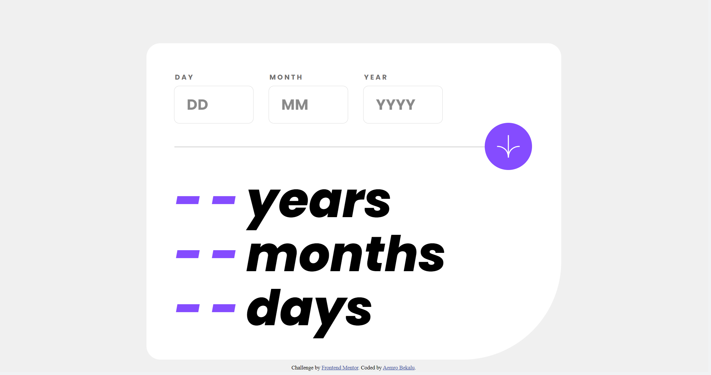

# Frontend Mentor - Age calculator app solution

This is a solution to the [Age calculator app challenge on Frontend Mentor](https://www.frontendmentor.io/challenges/age-calculator-app-dF9DFFpj-Q). Frontend Mentor challenges help you improve your coding skills by building realistic projects.

## Table of contents

- [Overview](#overview)
  - [The challenge](#the-challenge)
  - [Screenshot](#screenshot)
  - [Links](#links)
- [My process](#my-process)
  - [Built with](#built-with)
  - [What I learned](#what-i-learned)
  - [Continued development](#continued-development)
  - [Useful resources](#useful-resources)
- [Author](#author)
- [Acknowledgments](#acknowledgments)

## Overview

### The challenge

Users should be able to:

- View an age in years, months, and days after submitting a valid date through the form
- Receive validation errors if:
  - Any field is empty when the form is submitted
  - The day number is not between 1-31
  - The month number is not between 1-12
  - The year is in the future
  - The date is invalid e.g. 31/04/1991 (there are 30 days in April)
- View the optimal layout for the interface depending on their device's screen size
- See hover and focus states for all interactive elements on the page
- **Bonus**: See the age numbers animate to their final number when the form is submitted

### Screenshot

- mobile view
  

- desktop view
  

### Links

- Solution URL: [Add solution URL here](https://your-solution-url.com)
- Live Site URL: [Add live site URL here](https://your-live-site-url.com)

## My process

### Built with

- Semantic HTML5 markup
- CSS custom properties
- Flexbox
- CSS Grid
- Mobile-first workflow
- javascript

### What I learned

in this section I have learned how can I work with javascript dates.
I have also understand how can I validate the dates by incroporating the concept of the leap year.

- we can use the javascript date by using the constructor Dates which accepts an argument year,month,day and gives you the date in the string format

forexample:- I have born in april 12 02 2002. so to use this date inside the javascript I will give these values as an argument to the Date constructor but the thing which we have to take care is when we submit the month since the javascript month start countting from 0 you have to give the month by substracting one from your original month which you want to submit

```js
const dateOfBirth = new Date(
  2002,
  03,
  12
); /*result: Fri Apr 12 2002 00:00:00 GMT+0300 (East Africa Time) {}*/

//the way which I have used the concept of the leap year to validate my day is first I have build a function which accepts monthOfBirth and yearOfbirth as an argument and returns a function which can accept the date of birth
const validateDay = function (monthOfBirth, yearOfBirth) {
  //I have checked if the birth of year is a leap year by writing a function called 'checkLeapYear' which takes the yearOfBirth as an argument and returns 'true' for the years which are divisble by 4 except for the years which are also divisble by 100 and by 400, and returns 'false' for the years which are not divisble by 4

  //check if the year is leap year
  const checkLeapYear = function (yearOfBirth) {
    if (yearOfBirth % 4 === 0) {
      if (yearOfBirth % 100 === 0) {
        return yearOfBirth % 400 === 0;
      } else {
        return true;
      }
    } else {
      return false;
    }
  };

  //calling the checkLeapYear function with the yearOfBirth
  const isLeapYear = checkLeapYear(yearOfBirth);

  //I write a funciton 'validateDay' which can accept the date of birthOfYear and maximumDay(the day which the day of feburary shouldn't exceed) and if the yearOfBirth is a leapYear and if the day of the februry month exceeds the day 29 it will return an error and in the year which is 'not a leap year' it will return error if the day of februrary exceeds the day 28.

  const validateDay = function (dayOfBirth, maximumDay) {
    if (
      monthOfBirth === 3 ||
      monthOfBirth === 5 ||
      monthOfBirth === 9 ||
      monthOfBirth === 11
    ) {
      if (dayOfBirth < 1 || dayOfBirth > 30) {
        return "Must be valid Date";
      } else {
        return null;
      }
    } else if (monthOfBirth === 1) {
      if (dayOfBirth < 1 || dayOfBirth > maximumDay) {
        return "Must be valid Date";
      } else {
        return null;
      }
    } else {
      if (dayOfBirth < 1 || dayOfBirth > 31) {
        return "Must be valid Date";
      } else {
        return null;
      }
    }
  };

  //returns a function which accepts the 'dayOfBirth' and 'maximumDay' and call the validateDay function with the maximumDay of '29' if the year is a leap year and call it with the maximumDay of '28' if the year isnot a leap year
  return function (dayOfBirth) {
    if (isLeapYear) {
      return validateDay(dayOfBirth, 29);
    } else {
      return validateDay(dayOfBirth, 28);
    }
  };
};
```

### Continued development

I want to continue studying javascript and doing the challenges which help me to brush my skill of javascript

### Useful resources

as a resource for the javascript you can I recommend you to use the javascript course by jonas schmedtmann. it is a long udemy course but I can say it is worth to watch it

- [javascript course by jonas schemetmann](https://www.udemy.com/course/the-complete-javascript-course/) - This helped me to know more about css grid. I really like it . it is a video course by wesbos.

# Author

- Frontend Mentor - [@aemrobe](https://www.frontendmentor.io/profile/aemrobe)
- Twitter - [Aemro112](https://www.twitter.com/Aemro112)

## Acknowledgments

I want to thanks my @alexkmarshall from frontendmentor community. he has reccommend me in the previous challenge before this to use function to validate a form which is still usefull for this challenge too.
